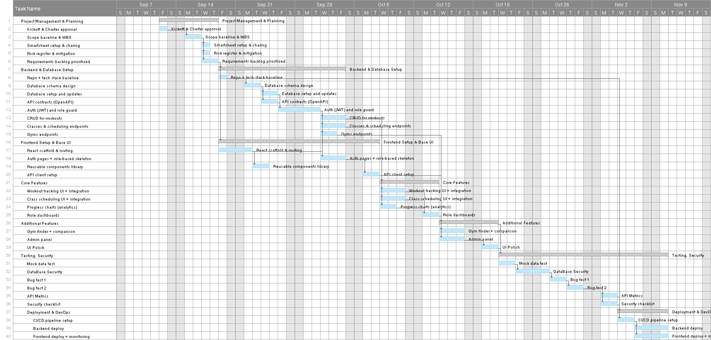

# FitBuddy – All-in-One Fitness Web App  

## Team Name and Members  
**Team FitBuddy**  
- **Abdullah Munir**  
- **Haider Ali**  
- **Raad Sarker**  

**Sponsor:** UBCO / Patricia Lasserre  
**Project Managers:** Tanhab Sarker & Anuradha Herath  
 

---

## Project Overview  

Many fitness apps today focus on only one feature — workout tracking, class booking, or gym discovery — forcing users to juggle multiple tools. **FitBuddy** provides a single, unified platform that combines all these services into one seamless experience.  

With FitBuddy, gym members, trainers, and owners can log workouts, schedule and attend classes, visualize their progress through analytics, and compare gyms nearby. The project aligns with our academic goals to design, develop, and deploy a full-stack web app within an eight-week term.

---

## Project Scope  

- **Workout Tracking:** Log sets, reps, and cardio sessions  
- **Class Scheduling:** Create, join, or cancel workout classes  
- **Progress Charts:** Visual analytics of user performance  
- **Gym Finder:** Compare gyms by facilities and membership cost  
- **Admin Panel:** Manage users, gyms, and system data  
- **Role-Based Dashboards:**  
  - **Members:** Register/login, track workouts, view progress, book classes  
  - **Trainers:** Upload workouts, manage classes  
  - **Admins:** Approve gyms, manage users, and moderate content  

---

## Tech Stack, Database & Libraries  

### **Frontend**
- React.js with Vite  
- React Router for routing  
- Tailwind CSS 

### **Backend**
- Node.js with Express.js  
- JWT authentication for secure sessions  

### **Database**
- PostgreSQL

### **Tools & Integrations**
- GitHub for version control  
- Smartsheet for project tracking and Gantt charting   
- Vercel  for deployment  

---

## 📊 Gantt Chart  

Below is the current Gantt chart tracking project tasks and deliverables.

**Full Interactive Link:**  
[View Gantt Chart on Smartsheet](https://app.smartsheet.com/workspaces/xjW6VfRv7vPXr3MXqJJjMcqvxhPC87H6CMpxWxX1)  

[View Dashboard](https://app.smartsheet.com/dashboards/4g6rHh947XpchhwCVhfPmQhgjvF67qCmmRcffqq1)

---

